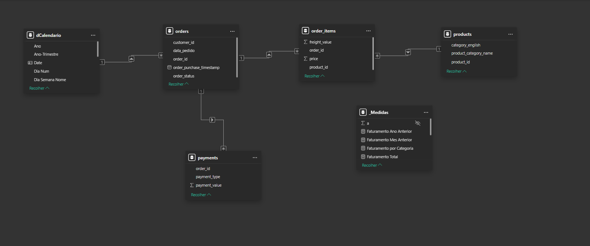
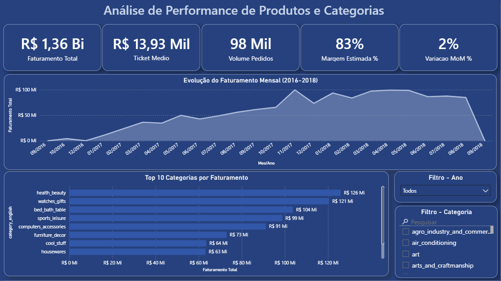
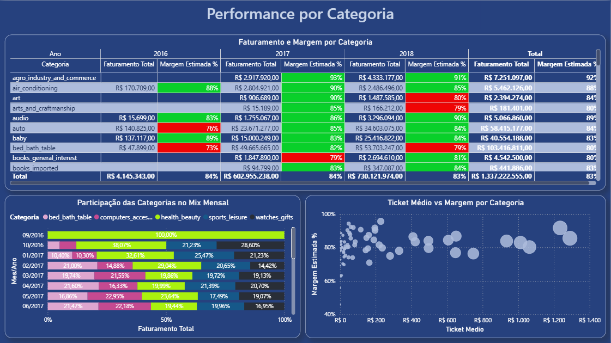
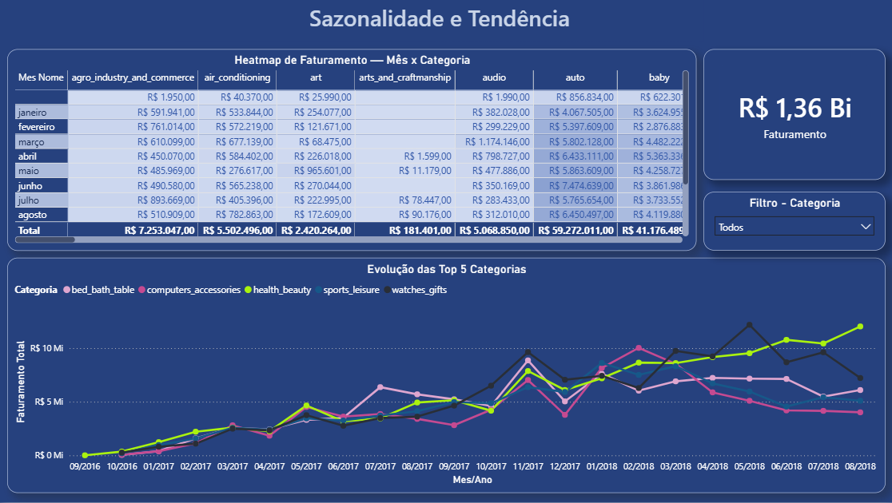

# Análise de Performance de Produtos e Categorias no Varejo
### Brazilian E-Commerce — Olist | Power BI

> **Ferramenta:** Power BI Desktop  
> **Dataset:** [Brazilian E-Commerce Public Dataset by Olist](https://www.kaggle.com/datasets/olistbr/brazilian-ecommerce) — Kaggle  
> **Período analisado:** Setembro/2016 a Novembro/2018  
> **Volume de dados:** +100 mil pedidos reais de e-commerce brasileiro

---

## Contexto e Problema de Negócio

A diretoria comercial identificou que o faturamento cresceu **12% no último ano**, porém a **margem operacional caiu 3 pontos percentuais**. A hipótese levantada foi que categorias de baixa margem ganharam participação no mix de produtos — puxando o resultado para baixo mesmo com mais receita.

**Pergunta central da análise:**
> *Quais categorias estão crescendo e destruindo margem ao mesmo tempo — e o que fazer com isso?*

---

## Objetivo

Construir um dashboard de 3 páginas no Power BI que permita à liderança comercial:

- Monitorar faturamento, ticket médio, volume e margem estimada por período
- Identificar quais categorias lideram em faturamento e quais drenam margem
- Visualizar padrões de sazonalidade e antecipar comportamento de demanda
- Propor ações de rebalanceamento de portfólio com base em dados

---

## Estrutura do Projeto

```
📁 olist-powerbi/
├── 📊 dashboard_olist.pbix          # Arquivo Power BI
├── 📄 README.md                     # Este arquivo
├── 📄 documentacao_tecnica.docx     # Documentação técnica completa
└── 📁 dados/
    ├── olist_orders_dataset.csv
    ├── olist_order_items_dataset.csv
    ├── olist_products_dataset.csv
    ├── olist_order_payments_dataset.csv
    └── product_category_name_translation.csv
```

---

## Modelo de Dados — Esquema Estrela

```
dCalendario ──(N:1)── orders ──(1:N)── payments
                         │
                       (1:N)
                         │
                    order_items ──(N:1)── products
```

A tabela **order_items** é a fato central do modelo. Todas as dimensões se conectam a ela ou a orders, com direção de filtro único para garantir propagação correta dos slicers.



---

## Tratamento dos Dados — Power Query

| Tabela | Principal Tratamento |
|---|---|
| `orders` | Filtro de status = 'delivered'; criação da coluna `data_pedido` |
| `order_items` | Tipagem de `price` e `freight_value`; remoção de colunas logísticas |
| `products` | Tratamento de nulos em categoria; merge com tabela de tradução |
| `payments` | Tipagem; substituição de 'not_defined' por 'other' |

---

## Medidas DAX Criadas

```dax
Faturamento Total     = SUM(order_items[price])
Volume Pedidos        = DISTINCTCOUNT(orders[order_id])
Ticket Medio          = DIVIDE([Faturamento Total], [Volume Pedidos])
Margem Estimada %     = DIVIDE(SUM(price) - SUM(freight_value), SUM(price))
Variacao MoM %        = DIVIDE([Fat. Total] - [Fat. Mes Anterior], [Fat. Mes Anterior])
Variacao YoY %        = DIVIDE([Fat. Total] - [Fat. Ano Anterior], [Fat. Ano Anterior])
Participacao no Mix % = DIVIDE([Fat. Total], CALCULATE([Fat. Total], ALL(products)))
```

---

## Dashboard — 3 Páginas

### Página 1 — Visão Executiva


Visão rápida do negócio: 5 cards de KPI no topo (Faturamento, Ticket Médio, Volume, Margem e Variação MoM), gráfico de linha com evolução mensal do faturamento de 2016 a 2018, ranking das Top 10 categorias por faturamento e slicers de ano e categoria.

**Decisão técnica:** O eixo X do gráfico de linha usa `Mes/Ano Ordem` (campo numérico no formato YYYYMM) como chave de ordenação e `Mes/Ano` como label — garantindo ordem cronológica correta e legibilidade simultâneas.

---

### Página 2 — Performance por Categoria


Análise detalhada por categoria: matriz com faturamento e margem por ano, com formatação condicional (verde ≥ 80% de margem, vermelho < 80%), gráfico de dispersão posicionando cada categoria por ticket médio e margem, e barras empilhadas 100% mostrando a evolução da participação das Top 5 categorias no mix mensal.

**Insight que essa página revela:** categorias com alto faturamento mas baixa margem — como `auto` (76%) e `bed_bath_table` (79%) — são candidatas a ação de rebalanceamento.

---

### Página 3 — Sazonalidade e Tendências


Análise temporal avançada: heatmap (matriz mês x categoria com cores por intensidade de faturamento), gráfico de linhas múltiplas com as Top 5 categorias ao longo do tempo, card que reage ao slicer de categoria e slicer de drill-down individual.

**Insight que essa página revela:** pico consistente de faturamento em novembro (Black Friday) em praticamente todas as categorias — padrão útil para planejamento de estoque e campanhas.

---

## Principais Insights

**1. health_beauty é a categoria de maior oportunidade**
Lidera o faturamento com margem de 91% e crescimento consistente de 2016 a 2018. É a melhor candidata para ganhar participação no mix.

**2. auto e bed_bath_table drenam margem**
Ambas com margem abaixo de 80% e alto volume — combinação que explica a queda de margem mesmo com crescimento de receita.

**3. Sazonalidade concentrada em novembro**
Black Friday gera pico de faturamento em todas as categorias. Planejamento antecipado de mix e estoque pode ampliar esse resultado.

**4. health_beauty cresce enquanto concorrentes oscilam**
Trajetória de crescimento estável e consistente ao longo de todo o período analisado.

---

## Como Visualizar

**Link do dashboard publicado:**
> 🔗 [Visualizar no Power BI Service](https://app.powerbi.com/view?r=eyJrIjoiM2UyNDdlYTAtYzYyMC00ZjZmLWEwNTUtNTMxYmUzYjk1OTEwIiwidCI6ImE0NTMyMzQyLWRjNjktNDhjMC1iODJhLTRhMWQ1ZDg2NGU2YiJ9)

**Para rodar localmente:**
1. Baixe os arquivos CSV no [Kaggle](https://www.kaggle.com/datasets/olistbr/brazilian-ecommerce)
2. Abra o arquivo `.pbix` no Power BI Desktop
3. Atualize o caminho das fontes de dados nas configurações

---

## Tecnologias Utilizadas

- **Power BI Desktop** — modelagem, DAX e visualização
- **Power Query (M)** — tratamento e transformação dos dados
- **DAX** — medidas de faturamento, margem, variação MoM/YoY e participação no mix
- **Esquema Estrela** — modelagem dimensional para performance dos filtros

---

## Contato

**Rafael Gomes Costa**  
Analista de Dados | Analista de BI  
📧 rafael67costa@gmail.com  
🔗 [LinkedIn](https://linkedin.com/in/rafael-costa-b89aa422b)  
🌐 [Portfólio](https://rafael7-costa.github.io/portifolio-de-projetos)
